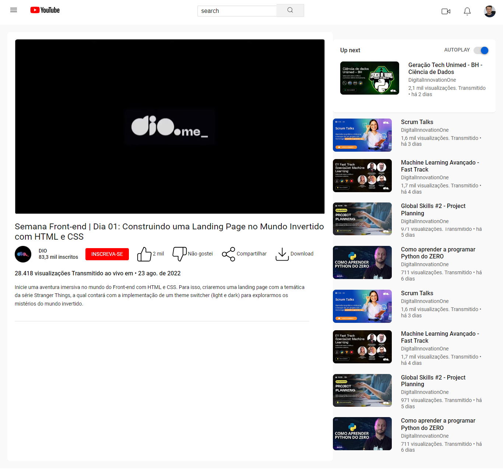

# Technical Report: Analysis of Provided HTML and CSS Code

## Introduction

The supplied code represents a fundamental structure for an HTML webpage accompanied by CSS styling. This webpage is designed for video playback, featuring a header, main content section, and a sidebar. This report aims to comprehensively analyze the structural, stylistic, and functional elements present in the provided code.

## Methods

1. **Structural HTML:**
   - The HTML adheres to a semantic structure, utilizing appropriate tags such as `<header>`, `<main>`, and `<aside>`.
   - Code structure is well-organized, promoting readability and ease of maintenance.
   - Semantic tags like `<nav>`, `<section>`, `<article>`, and `` have been strategically employed for clarity and understanding.

2. **CSS Styling:**
   - Styling is achieved through properties like `background-color`, `font-size`, `margin`, `padding`, and `border-radius`.
   - The color scheme is consistent, maintaining a visually pleasing aesthetic.
   - The grid system (`display: grid`) is implemented for the layout, providing flexibility and responsiveness.

3. **Responsiveness:**
   - The page is developed with responsiveness in mind, evident through the use of percentages, relative units, and media queries.
   - Consideration for mobile devices is demonstrated, ensuring a positive user experience across various screen sizes.

4. **Header Design:**
   - The header incorporates a left-aligned menu, a central logo, a search bar, and a right-aligned user menu.
   - SVG icons are used for a modern and scalable representation.

5. **Main Content:**
   - The main content section includes an iframe container for video display and a title section with relevant information.
   - User interaction elements such as like, dislike, share, and download buttons are thoughtfully included.

6. **Sidebar - Autoplay and Video Recommendations:**
   - The sidebar includes an autoplay section with a toggle button for user preference.
   - Video recommendations are presented in a grid format, featuring thumbnail images, titles, user details, and view counts.

## Results

The code effectively achieves its goal of creating a functional and visually appealing video playback webpage. The utilization of semantic HTML, well-structured CSS, and a responsive design approach contributes to a positive user experience.

## Conclusion

In conclusion, the provided HTML and CSS code exemplifies good coding practices, showcasing a well-organized structure and thoughtful styling for a video playback webpage. The inclusion of responsive design principles ensures adaptability to various devices, enhancing the overall accessibility and usability of the page.
